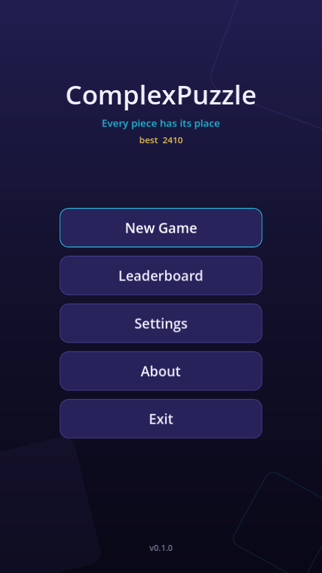
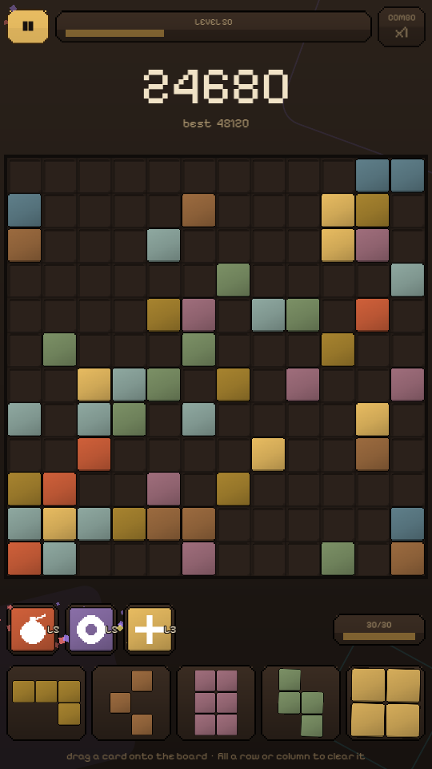
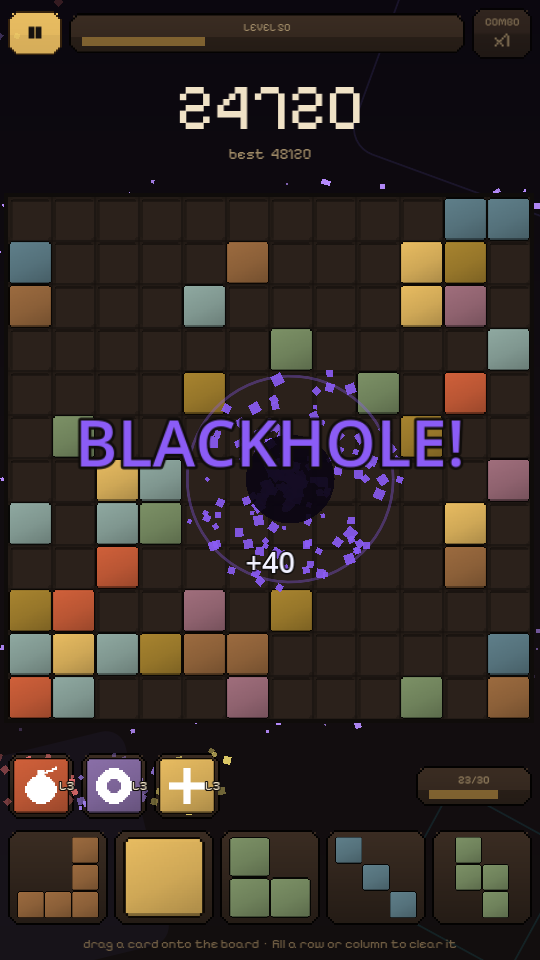
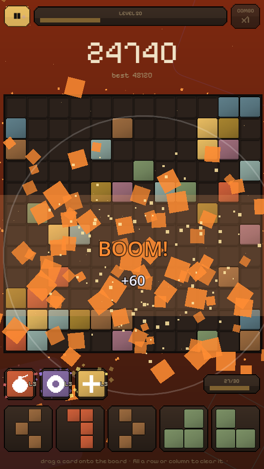
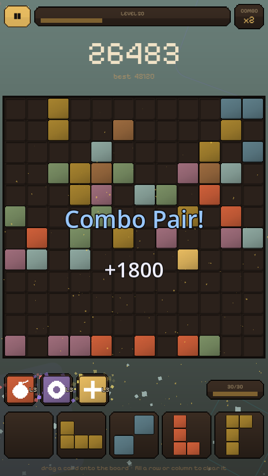
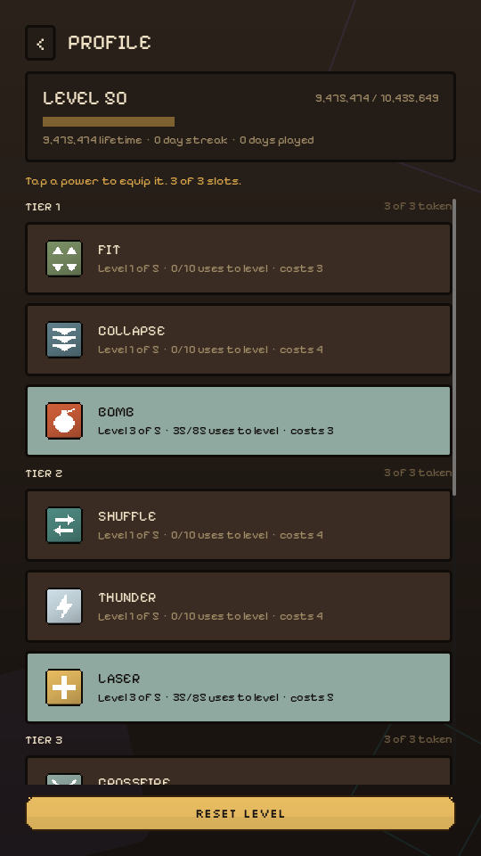
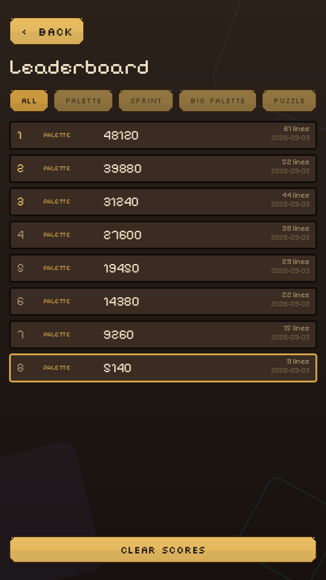

# Pixel Blast

A drag-and-drop block puzzle for Android and iOS, built with **Godot 4.7.2**.

Five cards sit in a tray at the bottom of the screen. Drag one onto the board; fill any row or column and it clears. The tray refills once all five are spent, and the run ends when nothing left in your hand fits anywhere — unless you have a power charged.

| Menu | Powers charged | Blackhole | Bomb |
|:---:|:---:|:---:|:---:|
|  |  |  |  |

| Line clear | The skill tree | Leaderboard |
|:---:|:---:|:---:|
|  |  |  |

## How it plays

**Placing.** Drag a card from the tray onto the board. The piece is drawn slightly *above* your finger so your thumb doesn't cover it, and a ghost shows where it will land — white when it fits, red when it doesn't. Release outside a legal spot and the card returns to its slot. Pieces never rotate; what you see in the tray is what you place.

**Clearing.** Any full row or column disappears. A piece can complete several lines at once, and a cell sitting on both a full row and a full column only counts once.

**Running out.** Cards that no longer fit anywhere are greyed out, so you can see trouble coming. When none of your remaining cards fit *and* you cannot afford a power, the game ends.

### Scoring

| Action | Points |
|---|---|
| Placing a piece | 1 per cell |
| Clearing lines | `100 × lines² × combo` |
| Destructive powers | 4–6 per cell destroyed |

Clearing **two lines at once** is worth far more than two separate clears — `100 × 2² = 400` against `100 + 100`.

**Combo** builds when you clear on consecutive placements and resets the moment you place without clearing. It caps at ×5.

## Powers

Thirteen powers sit in a strip above the tray. They are not dealt into your hand — you unlock them by levelling, equip three of them, and pay for each cast with **charge**, which is earned from combos (a 2× clear pays 1, a 5× pays 4).

| | |
|---|---|
| **Bomb** | A square blast, growing to half the board |
| **Blackhole** | A *disc*, so the corners a bomb would take survive |
| **Laser** / **Crossfire** | The row and column, or both diagonals |
| **Thunder** | Strikes random *occupied* cells — the answer to a board too full to place into |
| **Collapse** | Pulls columns down, closing the gaps a run leaves |
| **Fit** | Grows to fill the pocket it lands in |
| **Teleport** | Lifts a block and sets it down where it fits |
| **Earthquake** | Jostles blocks tighter, stopping the moment a line completes |
| **Meteor** / **Tsunami** | *Add* blocks — half, most or nearly all of the empty board — aiming to complete lines |
| **Shuffle** | Re-deals the tray with pieces that actually fit |
| **Rewind** | Undoes your last actions, board and tray together |

Each power has five levels of its own, earned by using it.

### The skill tree

Powers are ordered weakest to strongest and sealed behind account levels — 1, 25, 30, 45 and 50. **Rewind** breaks that order deliberately, coming early because forgiveness is worth least to the players who would meet it last. The **Bomb** opens the tree — it is the one power a beginner cannot misread — and at 3 charge it is the joint cheapest in the game, meant to be fired rather than saved for. Reaching a level banks an unlock you choose how to spend, but a banked unlock cannot skip a gate: the order you meet the powers in is fixed, which of each tier's you take is yours.

Levels come from **lifetime score**, so a bad run still advances something. Play three days running, or three times in one day, and the next run banks **double XP**.

## Modes

| | |
|---|---|
| **Palette** | The endless run. 8×8, growing to 12×12 at level 25 |
| **Big Palette** | The same rules, 12×12 from the start |
| **Sprint** | A 60-second fuse |
| **Puzzle** | A seeded starting board with a lines-to-clear objective. Powers are disabled — a seeded board plus a levelled bomb is not the same puzzle for two players |

## Running it

Requires **Godot 4.7.2**. No external dependencies or build steps.

Open `project.godot` in the editor and press Play, or:

```bash
/Applications/Godot.app/Contents/MacOS/Godot --path .
```

The game starts at `scenes/splash.tscn`. It's designed for 1080×1920 portrait; on desktop it opens in a half-size window so it fits on a monitor. To jump straight to a screen:

```bash
/Applications/Godot.app/Contents/MacOS/Godot --path . res://scenes/game.tscn
```

## Layout

```
autoload/   the 7 singletons -- 1:1 with project.godot's [autoload] block
rules/      board (grid, legality, clearing, scoring) · blocks (piece data)
scenes/     one screen = .tscn + .gd: splash, main_menu, game, modes,
            profile, leaderboard, settings, about
ui/         theme.tres, background · widgets/ effects/ fonts/ pixel/
platform/   device shims (haptics)
assets/     audio (42 tracks) and store icons
tools/      asset generators, and a path audit
docs/       architecture, powers, progression, theming, testing, invariants
```

The play screen keeps rules and presentation apart. `rules/board.gd` holds the grid, placement legality, clearing, scoring and the "no moves left" test, and reports through signals — it never touches the UI. `scenes/game.gd` listens and turns those signals into HUD updates, particles and screen shake. `ui/effects/effects.gd` spawns the particles and knows nothing about the game.

Pieces come from 18 base shapes in `rules/blocks.gd`; rotations are generated at load and de-duplicated. Adding a shape means adding one line.

## Platform notes

- **Portrait**, 1080×1920 design resolution, with `canvas_items` stretch so it adapts across phone aspect ratios.
- **Safe areas** are handled on Android and iOS — notches, rounded corners and the home indicator fold into the layout margins.
- **Metal** is the renderer on macOS and iOS; Godot 4.7 selects it by default.
- The **Exit** menu entry is hidden on iOS, since Apple rejects apps that quit themselves.
- Godot 4.7.2's iOS **simulator** slice is x86_64-only while Xcode 26 simulators are arm64-only, so the simulator cannot run this on Apple Silicon. Use a physical device, or the macOS build.

## Status

Playable end to end, with progression, thirteen powers, four modes, three themes, music and a persistent leaderboard.

Not done yet:

- **Game Center** is code-complete but needs the iOS plugin installed and App Store Connect leaderboards created — see `docs/gamecenter.md`.
- The leaderboard is otherwise **local only**; there is no backend.
- **Sound effects are placeholders** generated by `tools/gen_audio.py`. The music is by [Abstraction](https://abstractionmusic.com/) and is credited on the About page — that credit is a licence obligation.
- **No Android export preset** is configured; the iOS one is.

## Credits

Music by [Abstraction](https://abstractionmusic.com/). Fonts are vendored under `ui/fonts/` with their licences.
